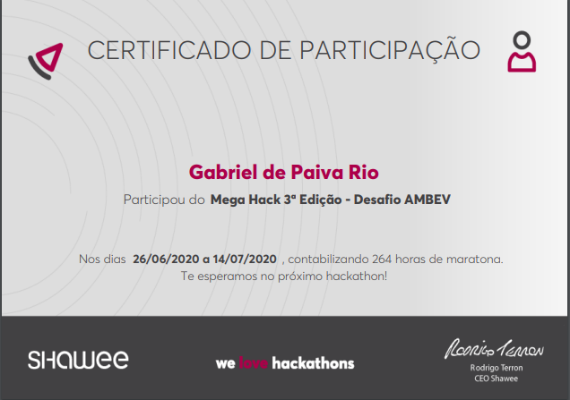

# MEGA-HACK
## 1º Lugar Desafio AMBEV
### 6º Lugar no Geral

#### Pitch: https://www.youtube.com/watch?v=RUTkjbinB9I&feature=youtu.be

#### Demo: https://www.youtube.com/watch?v=qJbFwcCdHyc&feature=youtu.be

**Telas Desenvolvidas por: Daniele Costa**  

#### Desafio AMBEV
**Objetivo do Aplicativo:**   
* Uma aplicativo que se comunique com uma Vending Machine. Ao fazer o pedido pelo celular, a pessoa poderá retirar na Geladeira mais proxima.
* A Geladeira é daquelas que digita ou insere o dinheiro e sai apenas o produto.
* Ao fazer a primeira compra é habilitado no aplicativo a opção de Meeting.
* O Meeting é similar ao Tinder, porem com alguns diferenciais, e com outro objetivo. O diferencial é que ao inves de formar matchs individuais, pode optar por match em grupo. Caso forme grupo com 3 ou mais pessoas, ganha-se descontos em produtos AMBEV ou até mesmo em outros produtos, a combinar, com o bar na qual eles vão.
 

**RODAR O CHAT:**
- **Por em resoluçao 620x375** (f12)
- `start server.js`

**NEW FEATURES:**
- Melhorar a funcionalidade de chat
- Fazer o projeto para mobile, usando Xamarin
- Pagamento funcionando
- Autenticaçao de Cadastro

**Interface**
- [x] Barra de Menu
- [x] Pagina principal
- [x] Pagina para o Chat
- [ ] Pagina de Like e Deslike
- [ ] Pagina para o Mapa
- [x] Pagina de login
- [x] Pagina de Compras
 

**Funcionalidades:**  
- [x] Chat
- [ ] Loguin(autenticação)
- [ ] Mapa para localizar as geladeiras.
- [ ] Like e Deslike 
- [ ] Mostrar pessoa individual ou pessoa em grupo (fotinho de cada)

**Agradecimento especial ao Time 24:**
_Não teria experiencia melhor para o primeiro Hackathon de todos nós sem vocês, melhor equipe que essa, impossivel hehe <3_
- Gabriel Rio (Developer Front-end)
- Nathalia Viana (Business)
- Eder Filho (Developer Back-end)
- Daniele Costa (Designer UX/UI)
- Wellyngton (Marketing)

Realizado em 05/07/2020   

